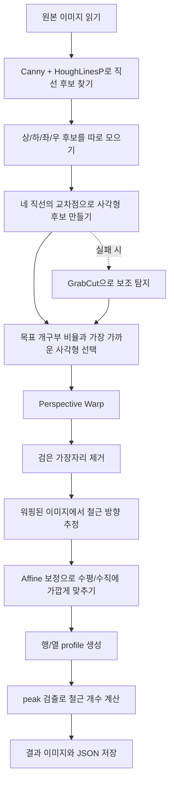

# 3차 시도 상세 정리

## 한 줄 요약

3차 시도에서는 사람이 네 꼭짓점을 찍지 않아도, 이미지에서 철근이 들어 있는 개구부의 외곽 사각형을 자동으로 찾고, 그 사각형을 기준으로 이미지를 반듯하게 편 다음, 철근 줄무늬의 반복 피크를 세어 개수를 구하는 흐름으로 바꿨다.

핵심은 “윤곽선 하나를 대충 찾는 것”이 아니라, “개구부를 이루는 네 변을 먼저 찾고, 그 교차점으로 외곽 사각형을 만드는 것”이다.

---

## 왜 3차 시도가 필요했는가

1차와 2차 시도에서는 외곽을 잡는 과정이 아직 불안정했다.

- 1차 시도는 사람이 직접 찍은 점에 의존해서, 자동화가 거의 되지 않았다.
- 2차 시도는 contour와 GrabCut을 더 잘 써 보려 했지만, 상단 벽이나 거푸집이 함께 잡히는 경우가 많았다.
- 그래서 perspective warp 이후 철근 간격이 망가지고, 카운팅 결과도 흔들렸다.

3차 시도의 목표는 분명했다.

- 완전 자동으로 외곽 사각형을 잡는다.
- `want.png`처럼 개구부의 네 꼭짓점을 기준으로 정면에 가깝게 편다.
- 반듯해진 화면에서 철근을 두 방향으로 나눠서 개수를 센다.

---

## 전체 처리 흐름



이 흐름에서 중요한 점은 Hough 기반 탐지가 1순위라는 것이다. GrabCut은 더 이상 주역이 아니라, Hough가 실패했을 때만 쓰는 보조 수단으로 남아 있다.

---

## 3차 시도에서 바뀐 핵심 아이디어

### 1) “외곽선 전체”보다 “네 변”을 먼저 찾는다

이 문제는 사실 일반적인 물체 분할보다, 사각형 구조를 찾는 문제에 가깝다.

철근이 놓인 바닥은 전체적으로 직선 구조가 강하고, 주변 거푸집도 큰 직선으로 둘러싸여 있다. 그래서 윤곽선을 잡는 것보다 직선을 찾는 편이 더 유리했다.

### 2) Hough 직선을 방향별로 나눠서 교차점을 만든다

이미지에서 검출된 직선들을 대충 모아 놓고 그냥 가장 큰 사각형을 찾으면, 상단 벽이나 오른쪽 기둥이 섞일 수 있다. 그래서 3차 시도에서는 선을 다음처럼 분리했다.

- top: 윗변처럼 보이는 수평에 가까운 선
- bottom: 아랫변처럼 보이는 수평에 가까운 선
- left: 왼쪽 변처럼 보이는 수직에 가까운 선
- right: 오른쪽 변처럼 보이는 대각선/사선 선

이 네 종류의 선을 하나씩 골라 교차시키면 외곽 사각형의 네 점이 만들어진다.

### 3) 목표 사각형에 가장 가까운 후보를 고른다

3차 시도에서는 `target_image.jpg`에서 개구부가 보이는 비율을 기준값으로 저장해 두었다.

즉, 완전히 아무 기준 없이 찾는 것이 아니라,

- “이 사진에서 개구부는 대략 이 비율쯤 있어야 한다”
- “윗변은 이쯤, 아랫변은 이쯤, 왼쪽 변은 이쯤, 오른쪽 변은 이쯤”

이라는 기준을 두고, 그에 가장 가까운 사각형을 선택한다.

이 방식 덕분에 GrabCut이 벽을 같이 먹어버리는 문제를 크게 줄일 수 있었다.

---

## 코드가 실제로 하는 일

### 입력과 저장

처음에는 원본 이미지를 읽고, 가장 먼저 `00_loaded_input.png`로 저장한다.

이 파일의 의미는 단순하다.

- “원본이 무엇이었는지”
- “이후 단계에서 얼마나 변했는지”

를 확인하기 위한 기준점이다.

### 자동 외곽 사각형 탐지

자동 탐지는 두 단계로 되어 있다.

1. Hough 기반 탐지
2. Hough가 실패하면 GrabCut 보조 탐지

Hough 기반 탐지는 다음 순서로 진행된다.

- Canny edge를 만든다.
- HoughLinesP로 직선 후보를 뽑는다.
- 직선을 상/하/좌/우 후보로 나눈다.
- 후보를 조합해 교차점을 구한다.
- 사각형 후보를 만든다.
- 목표 비율과의 차이가 가장 작은 후보를 고른다.

이때 저장되는 디버그 이미지는 `01_detection_debug.png`이다.  
이 이미지는 Hough가 실제로 어디를 선으로 보았는지 확인할 수 있게 해준다.

### Perspective warp

선택된 네 점이 생기면, 그 사각형을 기준으로 이미지를 정면에 가깝게 편다.

이 단계의 목적은 단순히 보기 좋게 만드는 것이 아니라, 철근 줄무늬의 간격이 일정한 방향으로 바뀌게 해서 이후 카운팅을 쉽게 만드는 것이다.

결과는 `03_perspective_warp.png`와 `04_trimmed_warp.png`로 저장된다.

### 축 추정과 affine 보정

warp만으로는 완전히 수평/수직이 되지 않을 수 있다.

그래서 워핑된 이미지를 다시 한 번 보고,

- 철근이 주로 어느 각도로 놓였는지
- 가로 방향과 세로 방향이 각각 어느 각도인지

를 추정한 뒤 affine 변환으로 더 곧게 맞춘다.

이 단계가 `06_axis_rectified.png`, `07_trimmed_rectified.png`이다.

### profile 기반 카운팅

카운팅은 픽셀 하나하나를 세는 방식이 아니다.

대신 다음과 같이 한다.

- 각 행과 각 열에서 gradient 강도를 누적한다.
- 철근이 있는 위치는 주변보다 반응이 강해진다.
- 그 위치에서 peak를 찾는다.
- peak 간 거리가 너무 가까우면 같은 철근으로 보고 하나만 남긴다.

즉, `x-axis direction`, `y-axis direction` 카운트는 “정렬된 화면에서 반복적으로 나타나는 철근 줄무늬의 봉우리 개수”라고 보면 된다.

`08_profiles.png`는 이 봉우리가 어떻게 잡혔는지 보여주는 그래프이고,  
`09_count_overlay.png`는 실제 이미지 위에 피크 위치를 그려서 결과를 확인하게 해준다.

---

## 3차 시도에서 사용한 주요 설정값

### `AUTO_GRABCUT_RECTS`

GrabCut 보조 탐지에서 쓰는 큰 시작 사각형 후보들이다.

이 값은 “개구부 주변을 대충 포함하는 큰 박스” 정도의 의미만 가진다.  
즉, 정답 사각형이 아니라 시작용 힌트다.

### `AUTO_APPROX_EPSILONS`

윤곽선을 4점 사각형으로 근사할 때 얼마나 단순화할지 조절하는 값이다.

작으면 점이 너무 많고, 크면 너무 뭉개진다.  
그래서 여러 값을 시도해서 딱 4점이 나오는 후보를 찾는다.

### `AUTO_OPENING_TARGET_FRACTIONS`

이건 3차 시도의 가장 중요한 기준이다.

`target_image.jpg`에서 개구부가 차지하는 대략적인 위치를 비율로 적어 둔 값이다.

예를 들어 “왼쪽 위 꼭짓점은 대략 이미지의 이 정도 위치”라는 식으로 저장해 둔 것이다.  
그래서 이미지 크기가 조금 달라도 같은 상대 위치를 기준으로 후보를 비교할 수 있다.

### `x_min_distance`, `y_min_distance`

peak 검출에서 너무 가까운 봉우리를 하나로 합치기 위한 최소 거리다.

이 값이 너무 작으면 같은 철근을 두 개로 셀 수 있고,  
너무 크면 실제 철근을 놓칠 수 있다.

### `peak_percentile`

profile에서 얼마나 강한 반응만 peak로 인정할지 정하는 기준이다.

값을 높이면 더 엄격해지고, 낮추면 더 많이 잡힌다.

---

## 결과 파일이 의미하는 것

| 파일 | 의미 |
| --- | --- |
| `00_loaded_input.png` | 원본 입력 이미지 |
| `01_detection_debug.png` | Hough edge / 자동 탐지 디버그 |
| `02_selected_quad.png` | 자동 선택된 외곽 사각형 표시 |
| `03_perspective_warp.png` | perspective warp 결과 |
| `04_trimmed_warp.png` | warp 후 검은 테두리 제거 결과 |
| `05_hough_edges.png` | warp된 이미지에서 다시 찾은 Hough edge |
| `06_axis_rectified.png` | 축 보정 전 결과 |
| `07_trimmed_rectified.png` | 축 보정 후 검은 테두리 제거 결과 |
| `08_profiles.png` | 행/열 profile 그래프 |
| `09_count_overlay.png` | 철근 개수 표시 오버레이 |
| `10_result.json` | 좌표, 각도, peak 위치, 카운트 수치 저장 |

---

## 현재 3차 시도의 실제 결과

현재 `target_image.jpg`에 대해 자동 탐지는 Hough 방식으로 성공했고, 선택된 외곽 사각형은 다음과 같다.

```text
[[97.53, 155.13],
 [372.14, 130.61],
 [513.91, 293.87],
 [120.64, 377.29]]
```

이 상태에서 나온 최종 카운트는 다음과 같다.

- x-axis direction count: 6
- y-axis direction count: 12

그리고 최종 결과는 `cv-class/결과/3차 시도/output/target_image/10_result.json`에 남아 있다.

---

## 왜 이 결과가 이전보다 나아졌는가

가장 큰 차이는 외곽 사각형이 “그럴듯한 contour”가 아니라 “개구부의 실제 네 변”에 더 가까워졌다는 점이다.

이전 시도에서는 다음 문제가 자주 있었다.

- contour가 벽까지 포함함
- perspective warp가 과하게 넓어짐
- 철근 간격이 찌그러짐
- profile peak가 엉뚱한 곳에서 튐

3차 시도에서는 외곽 사각형을 기하학적으로 직접 만들었기 때문에, warp된 결과가 더 안정적으로 나왔다.

---

## 아직 남아 있는 한계

3차 시도는 분명히 자동화가 좋아졌지만, 아직 완전히 일반화된 방법은 아니다.

- `AUTO_OPENING_TARGET_FRACTIONS`는 현재 사진에 맞춰 튜닝된 값이다.
- 다른 사진으로 바뀌면 후보 위치가 조금 달라질 수 있다.
- `peak_percentile`과 `min_distance`도 사진 상태에 따라 다시 조정될 수 있다.

즉, 지금 버전은 “이 사진에 대해 매우 잘 맞는 자동화”에 가깝고, 다음 시도에서는 이를 더 일반화하는 것이 좋다.

---

## 다음 시도에서 해볼 만한 것

1. 목표 사각형 비율을 이미지 크기와 무관하게 더 일반화하기
2. Hough 선 후보 점수를 더 정교하게 만들어서 후보 조합 수 줄이기
3. 꼭짓점 주변을 local search로 한 번 더 미세 조정하기
4. profile peak 검출을 사진 상태에 따라 자동으로 적응시키기
5. 여러 사진에 대해 같은 파이프라인이 버티는지 테스트하기

---

## 코드 위치

- 코드: `cv-class/결과/3차 시도/rebar_grid_counter.py`
- 결과 폴더: `cv-class/결과/3차 시도/output/target_image/`

